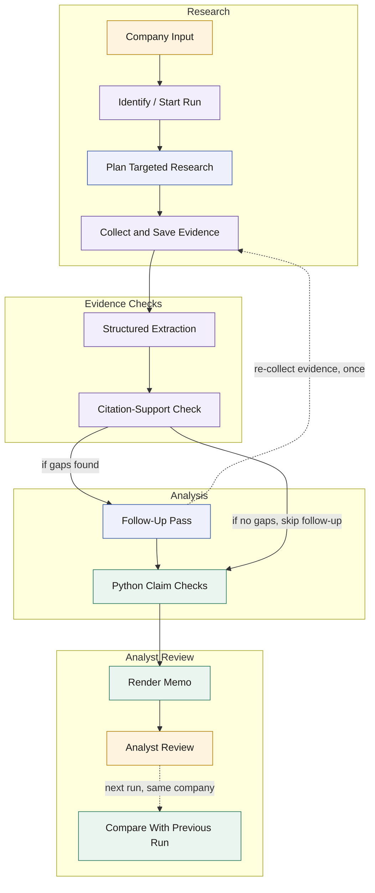

# FirstCheque

A local research workflow that turns a startup's name into a preliminary,
evidence-backed investment memo -- with every citation checked and every
number re-computed in Python, not trusted from the model's prose.

Built by Varun Mehta as a proof-of-work project for the Kalaari Capital
Fellowship, to show a repeatable way of using AI in a real research
process: real inputs, saved evidence, checked calculations, and my own
judgment recorded separately from the AI's draft.

## The research problem this solves

Reading press coverage of a startup and writing a one-page memo is slow,
and it is easy to accidentally treat "a headline said 6x growth" as if it
were a checked fact, or to average two conflicting numbers without
noticing they used different currencies or different definitions of
revenue. FirstCheque forces a specific discipline instead: every claim in
the memo either points at a saved passage from a real source, or it is
marked unverified; every ratio is computed from raw numbers in Python, not
asserted by the model; and a run's output is versioned so a later update
can show exactly what changed, rather than silently replacing the last
draft.

## What Claude Code does vs. what Python does

| | Claude Code (this session) | Python (`src/firstcheque/`) |
|---|---|---|
| Research | Plans searches, reads pages, judges relevance | -- |
| Extraction | Writes `memo.json` from what it read | Validates it against a schema (`schema.py`) |
| Judgment | Decides Meet/Track/Pass, writes risks and prose | -- |
| Citation checking | Reads each cited passage and judges support | Checks that cited source IDs actually exist (`cli.py validate-memo`) |
| Arithmetic | **Never.** Only extracts raw numbers with source IDs | Computes every ratio (`claims.py`) |
| Persistence | -- | Run folders, source-ID continuity, review carry-forward (`storage.py`) |
| Output | -- | Renders `memo.md` and a self-contained `memo.html` from validated data (`render.py`) |

**Why the LLM never does arithmetic**: a language model computing "20 Cr /
25.01 L monthly x 12" in its head is exactly the kind of thing that looks
right and is occasionally wrong in a way nobody checks, because the prose
reads fine either way. `claims.py` does every division with `Decimal`
arithmetic, has a unit test for each formula against a fixed fictional
company, and returns a structured `missing_input` / `zero_denominator` /
`currency_mismatch` / `metric_mismatch` status instead of a number when
the inputs don't support one. Claude's job is to get the raw inputs right
(with a source), not to do the division.

## How the workflow runs

```
company name
    |
    v
[1] identify the company        -- Claude: disambiguate by website if needed
    |
[2] plan targeted research      -- Claude: 4-6 queries (business model, funders,
    |                               funding, revenue, market, negative news)
    v
[3] retrieve + save evidence    -- Claude searches/fetches; python merges into
    |                               sources.json with stable, reusable source IDs
    v
[4] extract structured draft    -- Claude writes memo.json against the Memo schema
    |                               (Fact objects carry currency + metric_kind + sources)
    v
[5] check citations              -- Claude re-reads cited passages, marks each
    |                               claim supported/not; python checks structural
    |                               integrity (dangling source IDs)
    v
[6] one follow-up research pass -- Claude closes the biggest gaps it can, once
    |
    v
[7] compute claim checks         -- python only (claims.py): annualised revenue,
    |                               valuation multiple, ARPU, growth, capital
    |                               efficiency, capital raised/year, dilution
    v
[8] render memo.md + memo.html   -- python assembles Claude's prose + python's
    |                               numbers + footnoted sources into both a
    |                               plain-text and a self-contained HTML view
    v
[9] analyst review                -- YOU fill in review.md; the AI never touches it
    |
    v
[10] next run -> changes.md       -- python diffs this run against the last one
```



Legend: blue = Claude Code (research, judgment, writing), green = Python
(validation, arithmetic, rendering), amber = you (review and final
judgment), purple = a joint step where Claude does the judgment/research
half and a Python CLI command does the bookkeeping/validation half.
Dashed arrows are conditional -- the follow-up pass only runs if the
citation check finds a material gap, and "Compare With Previous Run" only
applies from a run's second pass onward. All nodes above are implemented
today; none are planned-only.

| Stage | Executor(s) | Implementation | Example artifact |
|---|---|---|---|
| Company Input | You | `.claude/skills/company-brief/SKILL.md` step 0 | -- |
| Identify / Start Run | Claude + Python | `cli.py::cmd_new_run`; SKILL.md step 1 | `memos/kaleidofin/run-002/` (created by `new-run`) |
| Plan Targeted Research | Claude | SKILL.md step 2 | -- |
| Collect & Save Evidence | Claude + Python | `cli.py::cmd_merge_sources`, `storage.py::merge_sources`; SKILL.md step 3 | [`memos/kaleidofin/run-001/sources.json`](memos/kaleidofin/run-001/sources.json) |
| Structured Extraction | Claude + Python | `schema.py::Memo`, `cli.py::cmd_validate_memo`; SKILL.md step 4 | [`memos/kaleidofin/run-001/memo.json`](memos/kaleidofin/run-001/memo.json) |
| Citation-Support Check | Claude + Python | `schema.py::citation_support_rate`, `cli.py::cmd_citation_check`; SKILL.md step 5 | citation-support line in [`memo.md`](memos/kaleidofin/run-001/memo.md) |
| Follow-Up Pass | Claude | SKILL.md step 6 | -- |
| Python Claim Checks | Python only | `claims.py` (7 formulas), `cli.py::cmd_compute_claims` | [`memos/kaleidofin/run-001/claim_checks.json`](memos/kaleidofin/run-001/claim_checks.json) |
| Render Memo | Python only | `render.py::render_memo_md` / `render_memo_html` | [`memos/jar/run-001/memo.html`](memos/jar/run-001/memo.html) |
| Analyst Review | You | `storage.py::write_review_template` / `is_review_blank`; SKILL.md step 9 | [`memos/kaleidofin/run-001/review.md`](memos/kaleidofin/run-001/review.md) |
| Compare With Previous Run | Python only | `render.py::render_changes_md`, `cli.py::cmd_diff`; SKILL.md step 10 | [`memos/kaleidofin/run-002/changes.md`](memos/kaleidofin/run-002/changes.md) |

The stage list, descriptions, executors and implementation pointers above
are generated from the same source of truth (`src/firstcheque/stages.py`)
that drives the interactive node diagram in `workflow.html` -- see
"Workflow map and saved-run inspector" below. This Mermaid diagram is
what GitHub renders inline on this page; it is not interactive.
`workflow.html` is a separate, clickable file meant to be opened locally
in a browser -- GitHub's file viewer will only show its raw source, not
run it.

## Citation support vs. fact verification

This project deliberately avoids the phrase "fact verification" for what
step 5 does, because that phrase overclaims. Three different things are at
play, and only the first two happen here:

1. **A citation** -- a claim points at a source ID.
2. **Citation support** -- Claude re-reads the source's saved passage and
   judges whether it actually backs the specific claim. This is what
   `citation_support_rate` in `schema.py` measures, and it is always
   reported with an explicit denominator (opinions and founder questions
   are excluded from it).
3. **Independent corroboration** -- a second, unrelated source confirming
   the same underlying fact. FirstCheque does not do this automatically;
   syndicated reporting of the same wire story is explicitly *not* treated
   as independent corroboration (see `storage.merge_sources`'s
   deduplication and the memo prose in the example runs, which flags
   lower-confidence single-source claims rather than treating them as
   confirmed).

A citation-support rate of "83% (10/12)" means 10 of 12 tracked factual
claims had a saved passage that Claude judged actually supports them --
not that 10 of 12 facts about the company are independently verified true.

## Calculation methodology

All formulas live in `src/firstcheque/claims.py`, each with a docstring
and a unit test in `tests/test_claims.py`. In summary:

- **Annualised revenue run rate** = monthly revenue x 12. Called that, not
  "ARR", unless a source establishes the revenue is actually recurring.
- **Valuation multiple** = valuation / annual revenue. `annual_revenue`
  must already be annual -- either disclosed directly (an NBFC's FY total
  income, say) or derived by annualising a monthly figure first. The
  10x/30x bands it reports against are labelled, cited heuristics, never
  an automated recommendation.
- **ARPU** = monthly revenue / paying customers (never registered/free
  users -- the schema's `metric_kind` field on `Fact` blocks that
  substitution).
- **Growth multiple** = a later revenue figure / an earlier one, with the
  two `as_of` dates carried into the assumptions.
- **Capital efficiency** = annual revenue / total capital raised (a rough
  signal, explicitly not a burn multiple).
- **Capital raised per year** = total capital raised / years since
  founding.
- **Implied dilution** = round size / post-money valuation, with the
  post-money assumption stated explicitly and a labelled 25% heuristic
  threshold.

Every formula also refuses to run, with a structured reason instead of a
number, when an input is missing, a denominator is zero, currencies
differ, or the `metric_kind` doesn't match what the formula expects (e.g.
GMV where revenue is required). The real Jar memo in this repo hits the
currency-mismatch case for real: its revenue is reported in INR and its
last confirmed valuation in USD, and the tool correctly declines to guess
an exchange rate rather than compute a multiple anyway.

All arithmetic is done with `Decimal`, keeping full precision; rounding
only happens in the display strings (`format_inr`/`format_usd`).

## Known bugs found and fixed by auditing the two example runs

Before adding the viewer's visual polish, the two example runs were
audited against their own economic meaning, not just checked for whether
the arithmetic executed. Two real bugs turned up:

1. `capital_raised_per_year` measured "years since founding" to *today*
   instead of to the same date the capital-raised figure was measured as
   of, silently pairing an old numerator with an inflated denominator.
   This understated the true rate by about 18% for Kaleidofin and about
   4.6x for Jar (whose early fundraising pace looked like USD 11.3M/year
   instead of the correct ~USD 52.3M/year). Fixed in both the underlying
   data and the formula, which now also emits a staleness note whenever
   two inputs to the same ratio are measured more than ~6 months apart
   (`claims.py::_as_of_gap_note`).
2. `finalize-run` was overwriting `run.json`'s `created_at` with the
   current time on every call, which would have made a later
   Python-only recomputation look like the original research happened
   then. `created_at` is now set once and preserved; a separate
   `updated_at` tracks re-runs.

Both are covered by regression tests (`tests/test_claims.py`,
`tests/test_cli.py`) so they can't silently reappear.

## Limitations

- **This runs inside a Claude Code session and a Claude subscription's
  included usage**, not a separately billed API. It is not a service that
  runs unattended; it needs an interactive (or scripted, but still
  Claude-Code-hosted) session to do the research and writing steps.
  Nothing in `src/firstcheque/` calls any LLM -- if you ran the CLI
  without Claude driving it, you'd get schema validation and arithmetic
  on whatever `memo.json` you handed it, and nothing else.
- **Tool availability varies by source.** Some sites (Business Standard,
  in the example runs here) return HTTP 403 to automated fetches. When
  that happens the workflow falls back to a search-engine summary,
  labelled `search_snippet` and treated as lower confidence -- it does not
  silently substitute a paid search API.
- **No independent fact verification.** See the citation-support section
  above. A high support rate means citations were checked against saved
  text, not that the underlying facts were independently confirmed.
- **The claim-check formulas assume clean inputs.** They will not catch a
  source that is simply wrong; they catch missing data, mismatched
  currencies/definitions, and zero denominators.
- **RDI theme list is unofficial.** `rdi.py`'s theme taxonomy is FirstCheque's
  own working list, built by reading the RDI Fund's public site (see that
  file's docstring for sources and access date), not a citation-grade
  legal enumeration. Treat any RDI fit in a memo as a lead worth checking,
  not a funding-eligibility determination.
- **No original TypeScript reference was available to port.** The project
  brief described an earlier `./firstcheque/` TypeScript build
  (`lib/types.ts`, `lib/claims.ts`, `lib/prompts.ts`, `lib/rdi.ts`) as the
  spec to port. That folder could not be found anywhere on this machine
  (checked via full-disk filename search), so everything here was built
  independently from the formulas, thresholds and schema described
  directly in the brief, not ported from existing code.
- **`workflow.html` was verified by two methods, not one.** Its
  functionality (run switching, node clicks, the copy-command fallback,
  console-error checks) was tested by serving the file over a temporary
  local static server, because the assistant's own browser-automation
  tool cannot script-interact with `file://` pages at all (confirmed
  directly: it refuses read/click/eval calls on a local-file tab). The
  file was then also opened for real via `file://` and handed off for a
  human click-through, since that is the actual way anyone will use it.
  Nothing in the page depends on being served (no `fetch`, no XHR, no
  relative-path assumptions that differ between `file://` and `http://`),
  but this gap between "tested" and "opened" is worth knowing about.

## How I review and override the draft

Every run gets its own `review.md`, generated blank and never written to
by the AI. It has four sections: corrections to the draft, disputed
claims, my own final recommendation, and follow-up questions. The draft's
`recommendation` field (Meet/Track/Pass) is explicitly a preliminary
research judgment, not a threshold computed from the claim checks --
`review.md` is where my actual judgment goes, and it survives later runs:
`storage.write_review_template` only creates a fresh blank review for the
new run, and copies a *completed* prior review forward as
`previous_review.md` (read-only reference) rather than overwriting it.

## Setup

Requires Python 3.11+.

```bash
python -m venv .venv
./.venv/Scripts/pip install -e ".[dev]"   # Windows; use .venv/bin/pip on macOS/Linux
./.venv/Scripts/python -m pytest -q
```

No API keys, `.env` file, or network credentials are needed to run the
Python side (schema validation, arithmetic, tests). Research and writing
happen through whatever Claude Code session invokes the skill.

## Running it

### Locally, via the skill

Inside a Claude Code session opened on this repo:

```
/company-brief Kaleidofin
```

See `.claude/skills/company-brief/SKILL.md` for the full step-by-step
instructions Claude follows, including how it handles ambiguous company
names, user-supplied context/documents, batch lists, and update runs.

### The CLI directly (what the skill calls)

Useful for understanding exactly what happens at each step, or for
re-rendering/re-checking a `memo.json` you already have:

```bash
./.venv/Scripts/python -m firstcheque.cli new-run "Company Name"
./.venv/Scripts/python -m firstcheque.cli merge-sources memos/company-name/run-001 new_sources.json
./.venv/Scripts/python -m firstcheque.cli validate-memo memos/company-name/run-001
./.venv/Scripts/python -m firstcheque.cli compute-claims memos/company-name/run-001
./.venv/Scripts/python -m firstcheque.cli citation-check memos/company-name/run-001
./.venv/Scripts/python -m firstcheque.cli render memos/company-name/run-001
./.venv/Scripts/python -m firstcheque.cli finalize-run memos/company-name/run-001 "Company Name" --tools-used WebSearch,WebFetch
./.venv/Scripts/python -m firstcheque.cli status "Company Name"
./.venv/Scripts/python -m firstcheque.cli log-event memos/company-name/run-001 --stage plan_research --executor claude --status ok
./.venv/Scripts/python -m firstcheque.cli generate-workflow-viewer
```

### Tests

```bash
./.venv/Scripts/python -m pytest -q
```

`tests/test_claims.py` covers every formula (including the brief's
fictional-company fixture: INR 25.01L monthly revenue, INR 20Cr valuation,
2,700 paying customers, INR 4.18L earlier revenue -> INR 3 Cr annualised
revenue, 6.7x multiple, INR 926 ARPU, 6.0x growth) plus missing-input,
zero-denominator, currency-mismatch and metric-mismatch cases.
`tests/test_schema.py` covers Memo validation, source-ID bounds,
unverified flagging, and preserving contradictory source figures rather
than averaging them. `tests/test_storage.py` covers run-folder
bookkeeping, source-ID continuity across runs, review carry-forward, and
an end-to-end pass from saved evidence through claim checks to a rendered
memo. `tests/test_cli.py` covers the annual-revenue resolution logic
(prefer a disclosed annual figure; otherwise derive one from monthly via
the same Python arithmetic, never ad hoc). `tests/test_workflow_viewer.py`
covers the stage-event log (append-only, never fabricated) and the
workflow.html generator (real-runs-only discovery, and that untrusted
source text can never break out of its embedded JSON block).

## Workflow map and saved-run inspector (`workflow.html`)

`workflow.html`, at the repo root, is a second, visual way to look at this
project -- an n8n-style node diagram of the pipeline above, plus a
saved-run inspector, built entirely from what's actually on disk under
`memos/`. It is a **local, self-contained file**: no server, no external
scripts or stylesheets, no network calls except when you click a source's
own external link. It does not run the workflow -- there is deliberately
no "Run" button.

Regenerate it any time (deterministic from whatever is currently saved):

```bash
./.venv/Scripts/python -m firstcheque.cli generate-workflow-viewer
```

Open it directly from disk in Chrome or Edge. It has four areas:

- **Header**: the selected company, its website, a "Saved research" label
  (and a "Saved example" label specifically for the two demo runs -- see
  below), the run selector, when it was researched vs. last recomputed,
  and an "Open memo" button.
- **Company selection**: "View saved research" lists every company with a
  saved run, clickable; "Research another company" is a text box that
  builds the exact `/company-brief <name>` command and a Copy button --
  the page states plainly that you paste this into a Claude Code session
  yourself, since a static HTML file cannot launch a subscription-backed
  agent. The copy button has a real fallback: if the browser denies
  clipboard access (common on a `file://` origin), the command is still
  sitting in a plain, selectable text field.
- **Workflow canvas**: the node diagram above, grouped into the same four
  lanes as the README diagram (Research / Evidence Checks / Analysis /
  Analyst Review), with a subtle executor label and a separate, real
  status dot per node -- who runs a stage and what actually happened last
  time are shown as two different things, not conflated. Click a node for
  a detail panel: plain-English description, inputs/outputs, the real
  implementation pointer, actual evidence (a real claim and its saved
  passage for citation checks; a real formula with labelled inputs, units,
  periods and sources for claim checks), the recorded status, artifact
  links, and the practical limitation.
- **Research quality summary**: citation support (with its numerator and
  denominator), material missing information, unresolved gaps and
  conflicting figures, and human review status -- reported as four
  separate figures, deliberately never combined into one confidence or
  investment score.

Six states are shown distinctly everywhere (never collapsed into a
generic error look): Completed, Failed, Not recorded, Insufficient data,
Not applicable, and Awaiting review. This is powered by a real,
append-only event log (`memos/<slug>/run-*/events.jsonl`, one line per
stage transition, written by `storage.py::append_event`): Python's own
stages log themselves automatically, and the skill instructs Claude to
log its own stages too (`cli.py log-event`). A run created before this
existed simply has no events for its earlier stages -- the viewer shows
"Not recorded" rather than guessing, and a recomputation's timestamp is
never presented as evidence that research happened then (event notes say
so explicitly, e.g. "Structural check + rate calculation only -- the
supported/unsupported judgment ... was made by Claude when it wrote
memo.json, not at this timestamp").

**This tool never picks a company for you.** Both saved example runs
exist because Claude selected them itself to demonstrate the workflow,
not because they were requested -- their `run.json` `execution_notes`
say so explicitly ("First real demo run", "Second real demo company"),
which is exactly how the viewer knows to label them "Saved example."
Every other run defaults to a neutral "Saved research" label -- this
project makes no automatic claim that a run was or wasn't user-requested
either way.

## Real example runs in this repo

- `memos/kaleidofin/run-001/` and `run-002/` -- a fintech NBFC with strong
  audited financial disclosure (via a CARE Ratings report) but no
  disclosed valuation or monthly revenue; most standard checks correctly
  show `missing_input`, while capital efficiency and capital-raised-per-year
  compute real numbers. `run-002` is a genuine update pass (one follow-up
  search, no material new disclosures found) and demonstrates
  `changes.md` reporting "unchanged" honestly rather than manufacturing a
  false delta.
- `memos/jar/run-001/` -- a consumer fintech where public reporting mixes
  an INR revenue figure with a USD valuation figure, which correctly
  triggers the currency-mismatch guard instead of a computed multiple; it
  also surfaces an active regulatory/legal risk (an FIR under the Banning
  of Unregulated Deposit Schemes Act, an RBI surveillance alert, and a
  SEBI public warning) that drives the memo's Pass recommendation.

## Two-minute demonstration script

1. **Input**: `/company-brief Kaleidofin` (or open `memos/kaleidofin/run-001/memo.html`
   directly in a browser -- no server needed).
2. **Evidence**: open `memos/kaleidofin/run-001/sources.json` -- source 1
   is a CARE Ratings PDF with a real passage and access date, not a
   paraphrase.
3. **Numerical check**: in `memo.html` (or `memo.md`), appendix
   section -- `capital_raised_per_year` shows the formula
   (`total_capital_raised / years_since_founding`), the inputs, the
   result (INR 35.33 Cr/year), and its source, while
   `annualised_revenue_run_rate` honestly shows `missing_input` because
   Kaleidofin doesn't disclose monthly revenue.
4. **Research gap**: the same memo's "Unresolved gaps" section flags the
   INR-324-crore-vs-USD-42-47-million discrepancy across sources, and
   explains why it wasn't silently reconciled.
5. **My review**: `memos/kaleidofin/run-001/review.md` -- blank, waiting
   for the analyst (me), never written to by the AI.

## Credit

The project brief referenced `langchain-ai/company-researcher` (MIT
licensed, archived) as an optional reference for research/reflection
patterns. No code from that repository is used here -- this project does
not depend on LangChain or LangGraph, since neither solved a concrete
problem that plain Python plus the Claude Code session's own tools didn't
already solve more simply. The credit is recorded here because the brief
asked it be checked and attributed if used; it was consulted only as
background reading, not copied from.
